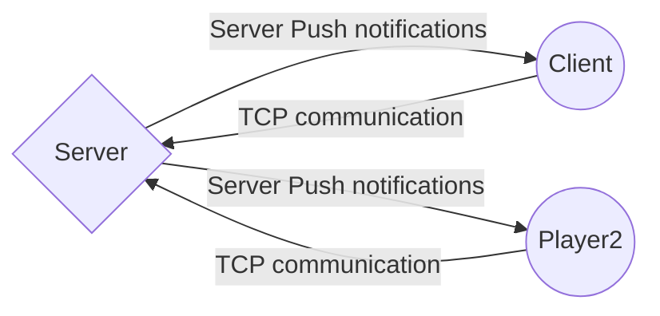

# PC Polo Game Example!

This is example project of PC polo game. 

Technology used:
- .Net Core 3.1/ C# 8.0
- Communication via TCP protocol
- Usage of the async/await construct

Use [Mermaid](https://mermaidjs.github.io/) to display simple diagram :)

# State on 13-03-2020
* I'm happy with game engine code.
* Server code require small refactor.
* Client side require much more refactor.

NOTE: Client don't receive messages from the server, maybe buffer is to big?
Anyway please type number and observe on server side that engine and game works.

So to summarize, looks like I'm more backend developer than frontend developer ;)